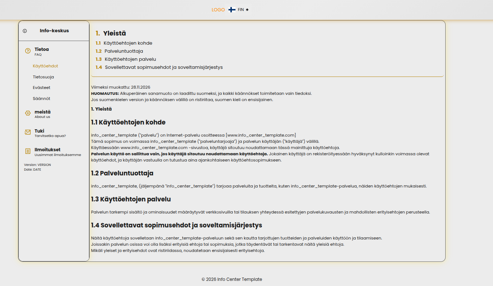
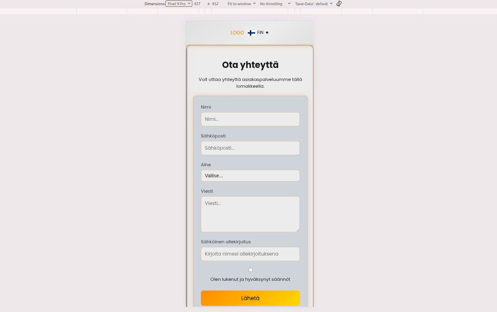

# Info Center

Lyhyt kuvaus projektista ja sen tarkoituksesta.

> Projektin tämänhetkinen tila: **[Ei aktiivisesti kehitetä / Aktiivisessa kehityksessä]**

---

## 📌 Tietoa projektista

**Info Center** on web-sovelluksen Info / Tietoa -osioon tarkoitettu kokonaisuus.

Projektin tarkoituksena on tarjota käyttäjälle selkeästi jäsenneltyä tietoa sovelluksesta, sen ominaisuuksista, käytöstä ja teknisestä toteutuksesta.

Sisältö voidaan jakaa esimerkiksi seuraaviin kokonaisuuksiin:

* Sovelluksen esittely
* Ominaisuudet
* Käyttöohjeet
* Tekninen toteutus
* Tietoturva
* Usein kysytyt kysymykset
* Projektin versio ja kehitystila

---

## ⚙️ Teknologia

* **Frontend:** React / Vite
* **Backend:** Node.js 
* **Tietokanta:** PostgreSQL 
* **API:** GraphQL

---

## 🚀 Käynnistäminen

Asenna projektin riippuvuudet:

```bash
npm install
```

Käynnistä kehityspalvelin:

```bash
npm ru
```



